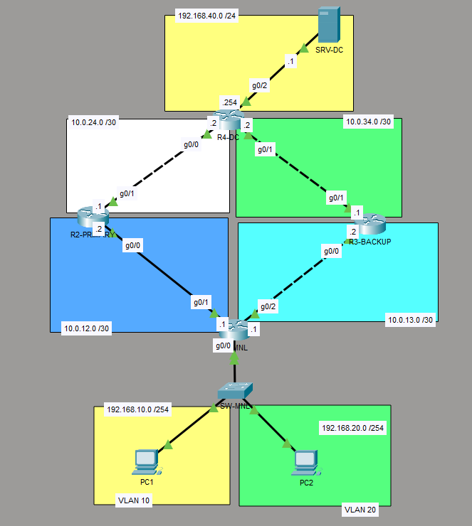
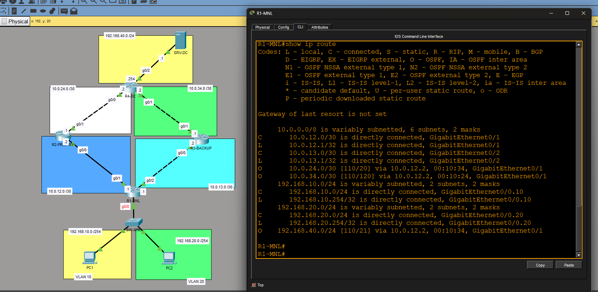
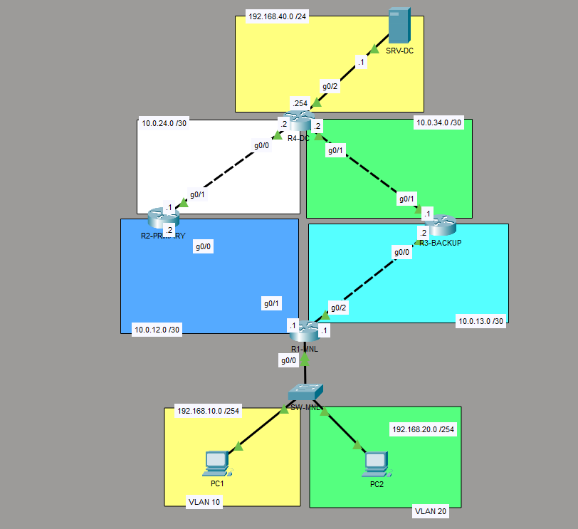
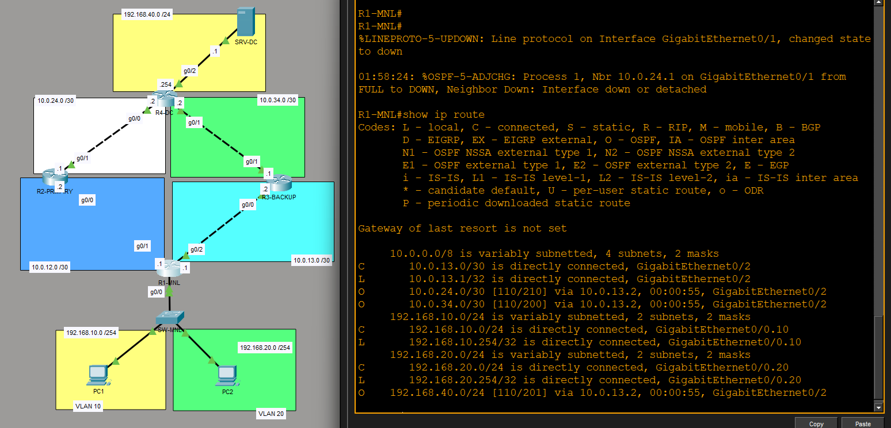
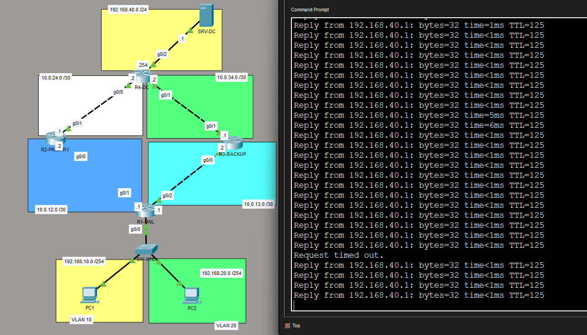
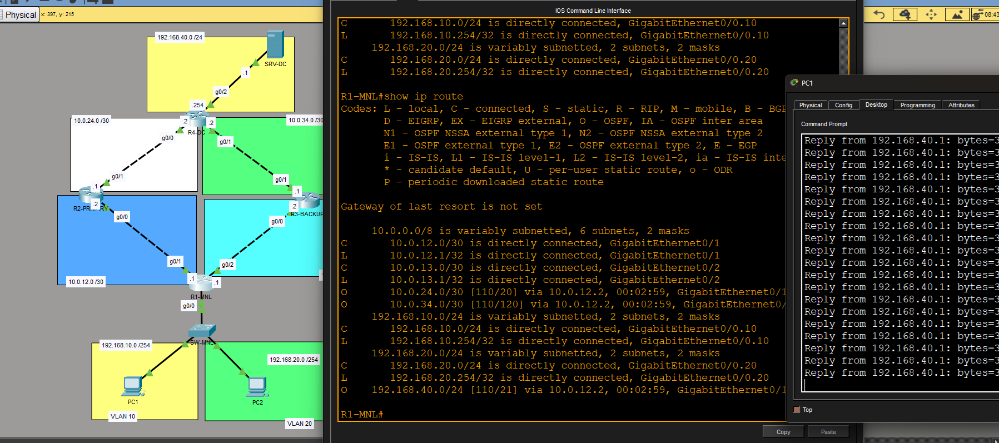

# Network Failover & Redundant WAN Routing

Cisco Packet Tracer lab demonstrating OSPF-based network redundancy and
automatic failover between primary and backup WAN paths.

## 1. Normal Network Operation

The network initially uses the primary WAN path through R2-PRIMARY.

## 2. Primary Routing Path

The routing table shows that the data center network is reached through
the primary R2-PRIMARY path.

## 3. Primary Link Failure

The R1-MANILA to R2-PRIMARY link was disconnected to simulate a WAN failure.

## 4. OSPF Failover

After OSPF convergence, the route to the data center was redirected
through R3-BACKUP.

## 5. Connectivity After Failover

Connectivity to the data center server was restored through the backup path.

## 6. Primary Route Recovery

After reconnecting the primary WAN link, OSPF reconverged and traffic
returned to the preferred path.

